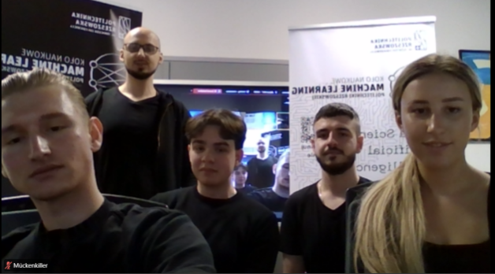
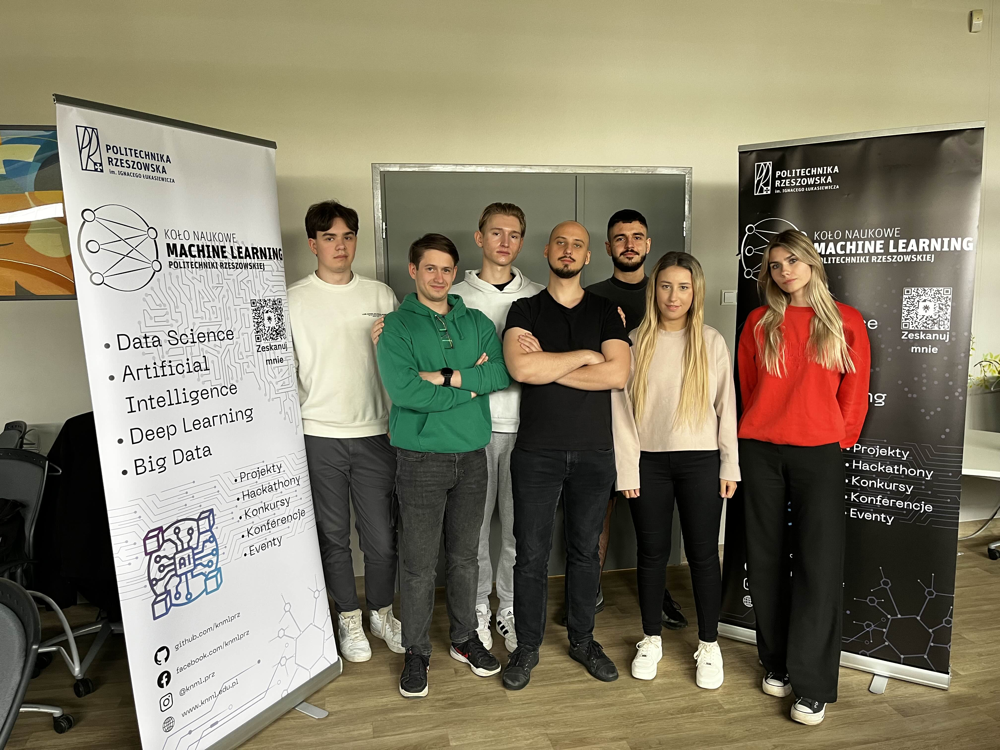

# Mückenkiller - 9th CASSINI Hackathon: Space for Healthcare

_Projekt opracowany przez Koło Naukowe Machine Learning Politechniki Rzeszowskiej_

**Nasza misja: Predict. Protect. Prevail.**

---

## 🚀 O Projekcie

**Mückenkiller** to innowacyjne rozwiązanie opracowane podczas 9. edycji CASSINI Hackathon "Space for Healthcare". Naszym celem jest stawienie czoła rosnącemu zagrożeniu ze strony komarów i chorób przez nie przenoszonych, problemowi potęgowanemu przez zmiany klimatyczne. Wykorzystujemy najnowocześniejsze technologie, aby przekształcać dane w praktyczne informacje dla zdrowszych społeczności, koncentrując się na inteligentnej, opartej na danych prewencji.

## 🌍 Problem: Niewidzialny Wróg Staje się Coraz Groźniejszy

Zmiany klimatyczne prowadzą do ekspansji siedlisk komarów, w tym tych przenoszących groźne choroby takie jak malaria, denga, Wirus Zachodniego Nilu czy Zika. Nowe regiony, w tym Europa Środkowa, stają się narażone, a tradycyjne metody walki z tym zagrożeniem często okazują się reaktywne, kosztowne i szkodliwe dla środowiska.

## 💡 Nasze Rozwiązanie: Mückenkiller - Inteligentna Tarcza

Mückenkiller to system wczesnego ostrzegania i wsparcia decyzji, który:

* **PREDICT (Przewiduje):**
    * Monitoruje, jak zmiany klimatu tworzą nowe miejsca lęgowe dla komarów (np. Anopheles przenoszących malarię).
    * Identyfikuje zmieniające się "gorące punkty" (hotspoty) chorobowe i prognozuje ewolucję sezonów transmisyjnych.
    * Wskazuje regiony podatne na pojawianie się ognisk epidemicznych.
    * **Jak?** Poprzez analizę **sfuzjowanych danych z różnorodnych źródeł**, w tym kluczowych **danych satelitarnych z programu Copernicus** (analiza wilgotności gleby, typów roślinności, obecności zbiorników wodnych) oraz **danych klimatycznych ERA5-Land**. Te dane są skrupulatnie przetwarzane przez nasz **zespół ekspertów specjalizujących się w meteorologii i naukach kosmicznych**, aby wydobyć z nich najcenniejsze informacje.

* **PROTECT (Chroni):**
    * Oferuje **PRECYZYJNE, OCHRONNE i NAPĘDZANE PREDYKCJĄ** podejście.
    * Umożliwia przejście od działań reaktywnych do **strategii proaktywnych**, wskazując dokładnie, gdzie i kiedy interwencje (np. ukierunkowane zwalczanie larw) są najbardziej potrzebne.
    * **Jak?** Wykorzystujemy **niestandardową architekturę sieci neuronowej**, zasilaną wnioskami z eksperckiego przetwarzania danych. To pozwala na znaczną redukcję użycia środków chemicznych i lepszą ochronę pożytecznych owadów.

* **PREVAIL (Zwycięża):**
    * Dąży do stworzenia **zdrowszych społeczności i planety** (mniej chorób, chronione zapylacze, zrównoważony ekosystem).
    * Umożliwia tworzenie **bezpiecznych przestrzeni ("Safe Zones")** i poprawę jakości życia.
    * Oferuje **inteligentny i zrównoważony wpływ** (efektywne kosztowo zarządzanie, odporność na zmiany klimatu, globalny wzór dla proaktywnych rozwiązań zdrowotnych).

## ✨ Nasza Przewaga Innowacyjna

* **Inteligentne Łączenie Danych (Smart Data Fusion):** Nasza **niestandardowa architektura** efektywnie integruje kluczowe dane satelitarne (Copernicus) i klimatyczne (ERA5-Land).
* **Eksperckie Przetwarzanie Danych:** Dane są przetwarzane przez nasz **wyspecjalizowany zespół** z dziedziny meteorologii i nauk kosmicznych, co zapewnia wysoką jakość i wiarygodność prognoz.
* **Precyzja Napędzana AI:** Zaawansowana sztuczna inteligencja i **zoptymalizowana sieć neuronowa** dla dokładnych i wczesnych prognoz.
* **Dostępność i Przystępność Cenowa:** Wykorzystanie danych open-access i efektywnych technologii.
* **Skalowalność i Adaptowalność:** Łatwość dostosowania do różnych regionów, chorób i zmieniających się warunków.

## 🛠️ Technologia (Streszczenie)

* **Dane Wejściowe:** Dane klimatyczne ERA5-Land, dane satelitarne Copernicus (Sentinel), dane epidemiologiczne (docelowo).
* **Przetwarzanie Danych:** Zaawansowane techniki przetwarzania dużych zbiorów danych, transformacja szeregów czasowych w wektory cech przez zespół ekspertów.
* **Model AI:** Niestandardowa, gęsto połączona sieć neuronowa, zoptymalizowana na podstawie wniosków z przetwarzania danych.
* **Wizualizacja Wyników:** Interaktywne heatmapy ryzyka.

## 🗺️ Kolejne Kroki (Roadmap)

* **Faza 1 (3-6 miesięcy):** Dalsze doskonalenie modelu AI, rozwój platformy MVP, pozyskanie partnerów do projektu pilotażowego.
* **Faza 2 (6-12 miesięcy):** Uruchomienie projektu pilotażowego, zbieranie danych operacyjnych i feedbacku, walidacja modelu.
* **Faza 3 (1-3 lata):** Skalowanie rozwiązania w Polsce i Europie, adaptacja do innych chorób przenoszonych przez wektory, pozyskanie dalszego finansowania.

## 🔗 Dowiedz się Więcej

* **Zobacz nasz projekt na platformie Taikai:** [Mückenkiller Idea - 9th CASSINI Hackathon](https://taikai.network/cassinihackathons/hackathons/space-for-healthcare/projects/cmaqzgqt502ck100kilj78jcq/idea)
* **Prezentacja projektu:** Nasza prezentacja podsumowująca projekt (w formacie PDF) jest dostępna w tym repozytorium GitHub.

## 🤝 Zespół

Projekt Mückenkiller został opracowany przez pełen pasji zespół studentów z **Koła Naukowego Machine Learning Politechniki Rzeszowskiej**.
* **Anna Bęben (@annbbbb):** Kieruje rozwojem AI. 
* **Mateusz Grabowski (@Gien3k):** Odpowiada za dane klimatyczne i mapy.
* **Hubert Mazur:** Buduje model AI.
* **Marcin Przybylski (@MMaurycy):** Łączy predykcje z potrzebami zdrowotnymi.
* **Mateusz Draus:** Zarządza konfiguracją serwerów.
* **Michał Wysocki:** Modelowanie danych.

  
  

## 📞 Kontakt

Chcesz dowiedzieć się więcej lub nawiązać współpracę? Skontaktuj się z nami!
---

*Dziękujemy za zainteresowanie projektem Mückenkiller! Razem możemy stworzyć bezpieczniejszą przyszłość.*
